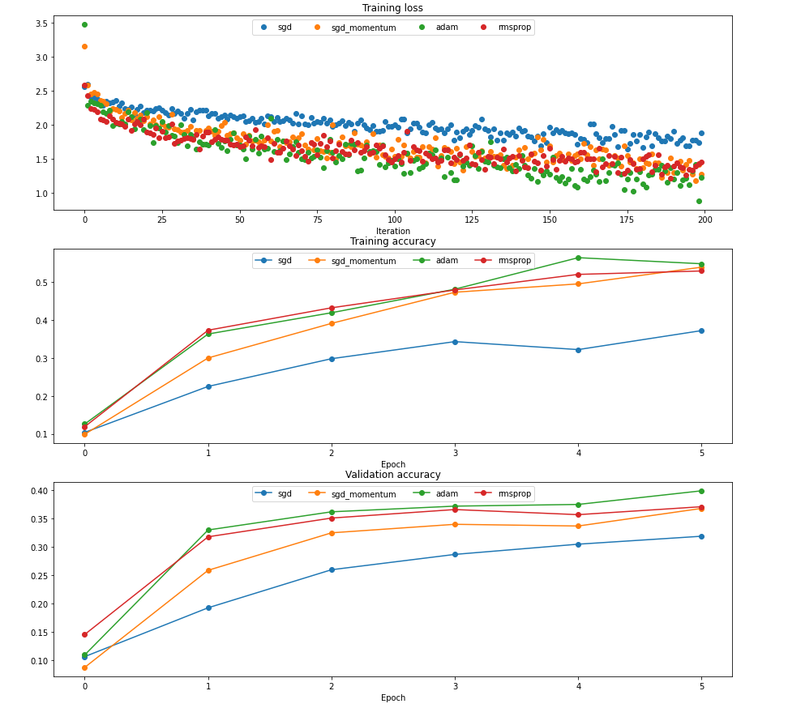

# FullyConnectedNets 
## Main (FC)
The main idea of this assignment is: Rather than using a monolithic function(Two-layer-net), implementing modular functional layers is more practical, in which we can stack layers to build various model for us. 
for each layer we can define 2 functions: layer_forward, layer_backward.
```py
def layer_forward(x, w):
  """ Receive inputs x and weights w """
  # Do some computations ...
  z = # ... some intermediate value
  # Do some more computations ...
  out = # the output

  cache = (x, w, z, out) # Values we need to compute gradients

  return out, cache
```
```py
def layer_backward(dout, cache):
  """
  Receive dout (derivative of loss with respect to outputs) and cache,
  and compute derivative with respect to inputs.
  """
  # Unpack cache values
  x, w, z, out = cache

  # Use values in cache to compute derivatives
  dx = # Derivative of loss with respect to x
  dw = # Derivative of loss with respect to w

  return dx, dw
```
1. import CI-FAR10 dateset
2. Affine layer: Forward and Backward

$\Large H=X\cdot W +B$
```py
def affine_forward(x, w, b):
    out = None
    shape=x.shape
    x=np.reshape(x,(x.shape[0],-1))
    out=x.dot(w)+b.T
    x=np.reshape(x,shape)
    cache = (x, w, b)
    return out, cache
```
$\Large \triangledown W=X^T\cdot\triangledown H$
```py
def affine_backward(dout, cache):
    x, w, b = cache
    dx, dw, db = None, None, None

    shape=x.shape
    db=np.sum(dout,axis=0)
    dx=dout.dot(w.T)
    dw=x.reshape((shape[0], -1)).T.dot(dout)

    return dx, dw, db
```
3. ReLU activation:  Forward and Backward

$\Large H_2=\max (0,H_1)$
```py
def relu_forward(x):
    out = None

    out=np.maximum(0,x)

    cache = x
    return out, cache
```
$\Large \triangledown H_1=\triangledown H_2*(H_1>0)$
```py
def relu_backward(dout, cache):

    dx=(x>0)*(dout)

    return dx
```
```
ReLU: When input<0, the gradient disappear
Sigmoid: when |input|>>0, the gradient disappear
leaky ReLU: gradient remains
```
4. Sandwich layers
```py
affine_relu_forward()
affine_relu_backward()
```
5. Loss layers: Softmax and SVM
```py
def svm_loss(x, y):
    """
    Computes the loss and gradient using for multiclass SVM classification.

    Inputs:
    - x: Input data, of shape (N, C) where x[i, j] is the score for the jth
      class for the ith input.
    - y: Vector of labels, of shape (N,) where y[i] is the label for x[i] and
      0 <= y[i] < C

    Returns a tuple of:
    - loss: Scalar giving the loss
    - dx: Gradient of the loss with respect to x
    """
    N = x.shape[0]
    correct_class_scores = x[np.arange(N), y]
    margins = np.maximum(0, x - correct_class_scores[:, np.newaxis] + 1.0)
    margins[np.arange(N), y] = 0
    loss = np.sum(margins) / N
    num_pos = np.sum(margins > 0, axis=1)
    dx = np.zeros_like(x)
    dx[margins > 0] = 1
    dx[np.arange(N), y] -= num_pos
    dx /= N
    return loss, dx


def softmax_loss(x, y):
    """
    Computes the loss and gradient for softmax classification.

    Inputs:
    - x: Input data, of shape (N, C) where x[i, j] is the score for the jth
      class for the ith input.
    - y: Vector of labels, of shape (N,) where y[i] is the label for x[i] and
      0 <= y[i] < C

    Returns a tuple of:
    - loss: Scalar giving the loss
    - dx: Gradient of the loss with respect to x
    """
    shifted_logits = x - np.max(x, axis=1, keepdims=True)
    Z = np.sum(np.exp(shifted_logits), axis=1, keepdims=True)
    log_probs = shifted_logits - np.log(Z)
    probs = np.exp(log_probs)
    N = x.shape[0]
    loss = -np.sum(log_probs[np.arange(N), y]) / N
    dx = probs.copy()
    dx[np.arange(N), y] -= 1
    dx /= N
    return loss, dx

```
6. Two-layer-net with layers implementation
```py
class TwoLayerNet(object):
    """
    A two-layer fully-connected neural network with ReLU nonlinearity and
    softmax loss that uses a modular layer design. We assume an input dimension
    of D, a hidden dimension of H, and perform classification over C classes.

    The architecure should be affine - relu - affine - softmax.

    Note that this class does not implement gradient descent; instead, it
    will interact with a separate Solver object that is responsible for running
    optimization.

    The learnable parameters of the model are stored in the dictionary
    self.params that maps parameter names to numpy arrays.
    """

    def __init__(
        self,
        input_dim=3 * 32 * 32,
        hidden_dim=100,
        num_classes=10,
        weight_scale=1e-3,
        reg=0.0,
    ):
        """
        Initialize a new network.

        Inputs:
        - input_dim: An integer giving the size of the input
        - hidden_dim: An integer giving the size of the hidden layer
        - num_classes: An integer giving the number of classes to classify
        - weight_scale: Scalar giving the standard deviation for random
          initialization of the weights.
        - reg: Scalar giving L2 regularization strength.
        """
        self.params = {}
        self.reg = reg

        ############################################################################
        # TODO: Initialize the weights and biases of the two-layer net. Weights    #
        # should be initialized from a Gaussian centered at 0.0 with               #
        # standard deviation equal to weight_scale, and biases should be           #
        # initialized to zero. All weights and biases should be stored in the      #
        # dictionary self.params, with first layer weights                         #
        # and biases using the keys 'W1' and 'b1' and second layer                 #
        # weights and biases using the keys 'W2' and 'b2'.                         #
        ############################################################################
        # *****START OF YOUR CODE (DO NOT DELETE/MODIFY THIS LINE)*****

        self.params['W1']=weight_scale*np.random.randn(input_dim,hidden_dim)
        self.params['W2']=weight_scale*np.random.randn(hidden_dim,num_classes)
        self.params['b1']=np.zeros((hidden_dim,))
        self.params['b2']=np.zeros((num_classes,))
        # *****END OF YOUR CODE (DO NOT DELETE/MODIFY THIS LINE)*****
        ############################################################################
        #                             END OF YOUR CODE                             #
        ############################################################################

    def loss(self, X, y=None):
        """
        Compute loss and gradient for a minibatch of data.

        Inputs:
        - X: Array of input data of shape (N, d_1, ..., d_k)
        - y: Array of labels, of shape (N,). y[i] gives the label for X[i].

        Returns:
        If y is None, then run a test-time forward pass of the model and return:
        - scores: Array of shape (N, C) giving classification scores, where
          scores[i, c] is the classification score for X[i] and class c.

        If y is not None, then run a training-time forward and backward pass and
        return a tuple of:
        - loss: Scalar value giving the loss
        - grads: Dictionary with the same keys as self.params, mapping parameter
          names to gradients of the loss with respect to those parameters.
        """
        scores = None


        X2,l1_cache=affine_relu_forward(X,self.params['W1'],self.params['b1'])
        scores,l2_cache=affine_forward(X2,self.params['W2'],self.params['b2'])

        if y is None:
            return scores

        loss, grads = 0, {}

        loss,dout=softmax_loss(scores,y)
        loss+=0.5 * self.reg * (np.sum(self.params['W1']**2) + np.sum(self.params['W2']**2))
        dfc2,dW2,db2=affine_backward(dout,l2_cache)
        dfc1,dW1,db1=affine_relu_backward(dfc2,l1_cache)
        grads['W1'] = dW1 + self.reg * self.params['W1']
        grads['W2'] = dW2 + self.reg * self.params['W2']
        grads['b1'] = db1
        grads['b2'] = db2

        return loss, grads
```
7. Solver and Train
```py
model = TwoLayerNet()
solver = None

solver=Solver(model,data,update_rule='sgd',optim_config={'learning_rate':1e-3},lr_decay=0.95,num_epochs=15,batch_size=500,print_every=100)
solver.train()
#Training result is in correspond jupyter notebook
```
8. Multilayer Network(with Dropout and Batch/Layer normalization)
```py
class FullyConnectedNet(object):
    """
    A fully-connected neural network with an arbitrary number of hidden layers,
    ReLU nonlinearities, and a softmax loss function. This will also implement
    dropout and batch/layer normalization as options. For a network with L layers,
    the architecture will be

    {affine - [batch/layer norm] - relu - [dropout]} x (L - 1) - affine - softmax

    where batch/layer normalization and dropout are optional, and the {...} block is
    repeated L - 1 times.

    Similar to the TwoLayerNet above, learnable parameters are stored in the
    self.params dictionary and will be learned using the Solver class.
    """

    def __init__(
        self,
        hidden_dims,
        input_dim=3 * 32 * 32,
        num_classes=10,
        dropout=1,
        normalization=None,
        reg=0.0,
        weight_scale=1e-2,
        dtype=np.float32,
        seed=None,
    ):
        """
        Initialize a new FullyConnectedNet.

        Inputs:
        - hidden_dims: A list of integers giving the size of each hidden layer.
        - input_dim: An integer giving the size of the input.
        - num_classes: An integer giving the number of classes to classify.
        - dropout: Scalar between 0 and 1 giving dropout strength. If dropout=1 then
          the network should not use dropout at all.
        - normalization: What type of normalization the network should use. Valid values
          are "batchnorm", "layernorm", or None for no normalization (the default).
        - reg: Scalar giving L2 regularization strength.
        - weight_scale: Scalar giving the standard deviation for random
          initialization of the weights.
        - dtype: A numpy datatype object; all computations will be performed using
          this datatype. float32 is faster but less accurate, so you should use
          float64 for numeric gradient checking.
        - seed: If not None, then pass this random seed to the dropout layers. This
          will make the dropout layers deteriminstic so we can gradient check the
          model.
        """
        self.normalization = normalization
        self.use_dropout = dropout != 1
        self.reg = reg
        self.num_layers = 1 + len(hidden_dims)
        self.dtype = dtype
        self.params = {}

        dims=np.hstack([input_dim,hidden_dims,num_classes])
        for i in range(self.num_layers):
            self.params['W'+str(i+1)]=weight_scale*np.random.randn(dims[i],dims[i+1])
            self.params['b'+str(i+1)]=np.zeros(dims[i+1])
        if self.normalization!=None:
            for i in range(self.num_layers-1):
                self.params['gamma'+str(i+1)]=np.ones(dims[i+1])
                self.params['beta'+str(i+1)]=np.zeros(dims[i+1])

        self.dropout_param = {}
        if self.use_dropout:
            self.dropout_param = {"mode": "train", "p": dropout}
            if seed is not None:
                self.dropout_param["seed"] = seed


        self.bn_params = []
        if self.normalization == "batchnorm":
            self.bn_params = [{"mode": "train"} for i in range(self.num_layers - 1)] #initialized the batchnorm params of multi layer
        if self.normalization == "layernorm":
            self.bn_params = [{} for i in range(self.num_layers - 1)]

        # Cast all parameters to the correct datatype
        for k, v in self.params.items():
            self.params[k] = v.astype(dtype)

    def loss(self, X, y=None):
        """
        Compute loss and gradient for the fully-connected net.

        Input / output: Same as TwoLayerNet above.
        """
        X = X.astype(self.dtype)
        mode = "test" if y is None else "train"

        # Set train/test mode for batchnorm params and dropout param since they
        # behave differently during training and testing.
        if self.use_dropout:
            self.dropout_param["mode"] = mode
        if self.normalization == "batchnorm":
            for bn_param in self.bn_params:
                bn_param["mode"] = mode #batchnorm mode train or test
        scores = None

        self.cache=[]
        self.out=[]
        self.dropcache=[]
        x=X
        gamma,beta,bn_param_i=None,None,None
        for i in range(self.num_layers-1):
            w=self.params['W'+str(i+1)]
            b=self.params['b'+str(i+1)]
            if self.normalization!=None:
                gamma=self.params['gamma'+str(i+1)]
                beta=self.params['beta'+str(i+1)]
                bn_param_i=self.bn_params[i] 
            x,cache=affine_norm_relu_forward(x,w,b,gamma,beta,bn_param_i,self.normalization)
            self.cache.append(cache)
            if self.use_dropout:
                x,cache=dropout_forward(x,self.dropout_param)
                self.dropcache.append(cache)
        scores,cache=affine_forward(x,self.params['W'+str(self.num_layers)],self.params['b'+str(self.num_layers)])
        self.cache.append(cache)

        if mode == "test":
            return scores

        loss, grads = 0.0, {}

        loss,dout=softmax_loss(scores,y)
        for i in range(self.num_layers):
            loss+=0.5*self.reg*np.sum((self.params['W'+str(i+1)]**2))
        dout,dW_last,db_last=affine_backward(dout,self.cache[self.num_layers-1])
        grads['W'+str(self.num_layers)]=dW_last+self.reg*(self.params['W'+str(self.num_layers)])
        grads['b'+str(self.num_layers)]=db_last
        for i in range(self.num_layers-2,-1,-1):
            if self.use_dropout:
                dout=dropout_backward(dout,self.dropcache[i])
            dx,dw,db,dgamma,dbeta=affine_norm_relu_backward(dout,self.cache[i],self.normalization)
            dout=dx
            grads['W'+str(i+1)]=dw+self.reg*(self.params['W'+str(i+1)])
            grads['b'+str(i+1)]=db
            if self.normalization!=None:
                grads['gamma'+str(i+1)]=dgamma
                grads['beta'+str(i+1)]=dbeta

        return loss, grads
        #Training result is in correspond jupyter notebook
```
## Main (Update rules)
1. SGD with Momentum http://cs231n.github.io/neural-networks-3/#sgd
```py
#Vanilla SGD
x+=-learning_rate*dx
#SGD with Momentum
v=mu*v-learning*dx
x+=v
```
implemention
```py
def sgd_momentum(w, dw, config=None):
    """
    Performs stochastic gradient descent with momentum.

    config format:
    - learning_rate: Scalar learning rate.
    - momentum: Scalar between 0 and 1 giving the momentum value.
      Setting momentum = 0 reduces to sgd.
    - velocity: A numpy array of the same shape as w and dw used to store a
      moving average of the gradients.
    """
    if config is None:
        config = {}
    config.setdefault("learning_rate", 1e-2)#若无，则设为1e-2
    config.setdefault("momentum", 0.9)
    v = config.get("velocity", np.zeros_like(w))# 如果有，就给v 没有就给全0矩阵

    next_w = None

    m=config["momentum"]
    lr=config["learning_rate"]
    v=m*v-dw   #1/1-m
    next_w=w+v*lr

    config["velocity"] = v

    return next_w, config

```
$\Huge or$
```py
    m=config["momentum"]
    lr=config["learning_rate"]
    v= mv - dw
    next_w= w + lr*v
```
Making the moving average to make previous velocity decrease

2. RMSProp and Adam 

These two optimization's prototype is AdaGrad. AdaGrad using second order momentum to make Learning rate adaptive. 
```py
cache += dx**2
x += - learning_rate * dx / (np.sqrt(cache) + eps)
``` 
However, in case of Deep Learning, the monotonic learning rate usually proves too aggressive and stops learning too early.

RMSProp introducing decay rate to restrict the shrink of learning rate(Moving average)
```py
cache = decay_rate * cache + (1 - decay_rate) * dx**2
x += - learning_rate * dx / (np.sqrt(cache) + eps)
```
implementation
```py
def rmsprop(w, dw, config=None):
    """
    Uses the RMSProp update rule, which uses a moving average of squared
    gradient values to set adaptive per-parameter learning rates.

    config format:
    - learning_rate: Scalar learning rate.
    - decay_rate: Scalar between 0 and 1 giving the decay rate for the squared
      gradient cache.
    - epsilon: Small scalar used for smoothing to avoid dividing by zero.
    - cache: Moving average of second moments of gradients.
    """
    if config is None:
        config = {}
    config.setdefault("learning_rate", 1e-2)
    config.setdefault("decay_rate", 0.99)
    config.setdefault("epsilon", 1e-8)
    config.setdefault("cache", np.zeros_like(w))

    next_w = None
    e=config['epsilon']
    lr=config['learning_rate']
    dr=config['decay_rate']
    cache=config['cache']
    cache=dr*cache+(1-dr)*dw**2
    next_w=w-lr*dw/(np.sqrt(cache)+e)
    config['cache']=cache

    return next_w, config
```
A brief Theoretical explanation of Second Order Momentum applied by AdaGrad and RMSProp:
To solve the problem when grads high in x-dim but low in y-dim, which looks like our loss is in a oval hyperplane, we stretch the oval shape into round shape(we can regard it as a penalization to x-dim)

$\Large \frac{x^2}{a^2}+\frac{y^2}{b^2}=1 \rightarrow \frac{x^2}{d^2}+\frac{y^2}{d^2}=C$

Adam introduces First and Second Order Momentum(the first order momentum is slight different from SGD momentum)
```py
m = beta1*m + (1-beta1)*dx
v = beta2*v + (1-beta2)*(dx**2)
x += - learning_rate * m / (np.sqrt(v) + eps)
#simplified
```
```py
m = beta1*m + (1-beta1)*dx
mt = m / (1-beta1**t)
v = beta2*v + (1-beta2)*(dx**2)
vt = v / (1-beta2**t)
x += - learning_rate * mt / (np.sqrt(vt) + eps)
#complete 
```
bias correction aims to make the momentum estimate and gradient variance estimate more accurate in early iterations of the Adam algorithm
implementation 
```py
def adam(w, dw, config=None):
    """
    Uses the Adam update rule, which incorporates moving averages of both the
    gradient and its square and a bias correction term.

    config format:
    - learning_rate: Scalar learning rate.
    - beta1: Decay rate for moving average of first moment of gradient.
    - beta2: Decay rate for moving average of second moment of gradient.
    - epsilon: Small scalar used for smoothing to avoid dividing by zero.
    - m: Moving average of gradient.
    - v: Moving average of squared gradient.
    - t: Iteration number.
    """
    if config is None:
        config = {}
    config.setdefault("learning_rate", 1e-3)
    config.setdefault("beta1", 0.9)
    config.setdefault("beta2", 0.999)
    config.setdefault("epsilon", 1e-8)
    config.setdefault("m", np.zeros_like(w))
    config.setdefault("v", np.zeros_like(w))
    config.setdefault("t", 0)

    next_w = None

    config['t']+=1
    e=config['epsilon']
    lr=config['learning_rate']
    b1,b2=config['beta1'],config['beta2']
    config['m']=b1*config['m']+(1-b1)*dw  #full form of momentum  
    config['v']=b2*config['v']+(1-b2)*dw**2
    m_ub=config['m']/(1-b1**config['t'])
    v_ub=config['v']/(1-b2**config['t'])
    next_w=w-lr*m_ub/(np.sqrt(v_ub)+e)


    return next_w, config

```
2. Comparison 

3. Train a good model
```py
best_model = None
best_val_acc=0

print("start!")
for i in range(5):
    lr=10**np.random.uniform(-2.93,-2.85)
    regl=10**np.random.uniform(-4,-3.8)
    ws=10**np.random.uniform(-2,-1)
    model= FullyConnectedNet([100, 100, 100, 100, 100],dropout=0.9,normalization="batchnorm",reg=regl,weight_scale=ws)
    solver=Solver(model,data,update_rule="adam",optim_config={"learning_rate":lr},batch_size=200,num_epochs=10,verbose=False)
    solver.train()
    if solver.best_val_acc>best_val_acc:
        best_model=model
        best_val_acc=solver.best_val_acc
    print("lr %e,ws %e,regl %e val_acc:%f THIS IS NO.%d"%(lr,ws,regl,solver.best_val_acc,i))
print("best val_acc %f"%(best_val_acc))


```
## New Stuff / Features
1. Optimizations: SGD-Momentum and Adam is good enough (However!! Adam might be Inconvergence)
2. Activation: Relu, eLU, leaky ReLU, tanh is good, don't try Sigmoid
