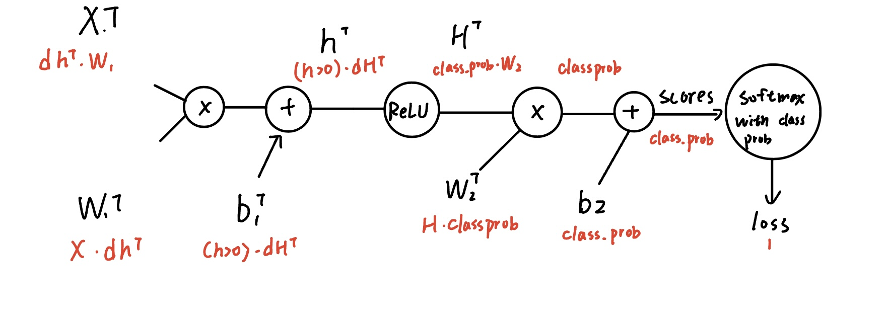

# Two-Layer Neural Network
## Main
1. Import CI-far 10 data set
2. Split the data into train, Val. And test sets.
3. Reshape the image data into rows
4. Subtract the mean image(all features of each image minus the mean_image)
5. be familiarized by small sets with toy net
```
Forward pass to compute loss:
the 2-layer fully connected neural net's expression: 
```
$\large f=W_2\cdot ReLU(W_1x+b_1)+b_2$
```
ReLu is one of activation functions, used to make the first layer nonlinear, 
which can be expressed as max(0,x)
```
$\rightarrow f=ReLU(x^TW^T_1+b^T_1)+b^T_2$
```py
h=X.dot(W1)+b1
H=np.maximum(0,h) # ReLU
scores=H.dot(W2)+b2
```
```
with Softmax:
```
$P(Y=k|X=X_i)={\Large e^{s_y}\over \sum{e^{s_j}}}$

$Li=-\log(P)=-\log{\LARGE e^{s_y}\over \sum{e^{s_j}}}, (\log = \ln)$

$\LARGE {e^{s_y}\over \sum{e^{s_j}}} ={Ke^{s_y}\over \sum{Ke^{s_j}}}={e^{s_y+logK}\over \sum{e^{s_j+logK}}}$
```py
scores-=np.max(scores,axis=1).reshape(-1,1)
scores=np.exp(scores)
denominator=np.sum(scores,axis=1)
prob=scores[range(N),y]/denominator
loss=np.sum(-np.log(prob))/N+reg*np.sum(W1**2)+reg*np.sum(W2**2)
```
```
Backpropagation to compute gradients
Use the Computational Graph.
```
$Add\space Gate:distribute$

$Max\space Gate:router$

$Mul gate: Switcher$


```py
    # Backward pass: compute gradients
    grads = {}
    #############################################################################
    # TODO: Compute the backward pass, computing the derivatives of the weights #
    # and biases. Store the results in the grads dictionary. For example,       #
    # grads['W1'] should store the gradient on W1, and be a matrix of same size #
    #############################################################################
    fixed_prob=scores/(denominator.reshape(-1,1))
    fixed_prob[range(N),y]-=1 #correct class -1 to be fixed
    dW2=H.T.dot(fixed_prob)
    db2=np.sum(fixed_prob,axis=0)
    grads['W2']=dW2/N+2*reg*W2
    grads['b2']=db2/N
    dH=fixed_prob.dot(W2.T)
    dh=(H>0)*dH
    db1=np.sum(dh,axis=0)
    dW1=X.T.dot(dh)
    grads['W1']=dW1/N+2*reg*W1
    grads['b1']=db1/N
```
6. SGD to train the network
```
train
```
```py
      indexes=np.random.choice(num_train,batch_size)
      X_batch=X[indexes,:]
      y_batch=y[indexes]
      #########################################################################
      #                             END OF YOUR CODE                          #
      #########################################################################

      # Compute loss and gradients using the current minibatch
      loss, grads = self.loss(X_batch, y=y_batch, reg=reg)
      loss_history.append(loss)

      #########################################################################
      # TODO: Use the gradients in the grads dictionary to update the         #
      # parameters of the network (stored in the dictionary self.params)      #
      # using stochastic gradient descent. You'll need to use the gradients   #
      # stored in the grads dictionary defined above.                         #
      #########################################################################
      self.params['W1']-=learning_rate*grads['W1']
      self.params['b1']-=learning_rate*grads['b1']
      self.params['W2']-=learning_rate*grads['W2']
      self.params['b2']-=learning_rate*grads['b2']
```
```
predict
```
```py
def predict(self, X):
    """
    Use the trained weights of this two-layer network to predict labels for
    data points. For each data point we predict scores for each of the C
    classes, and assign each data point to the class with the highest score.

    Inputs:
    - X: A numpy array of shape (N, D) giving N D-dimensional data points to
      classify.

    Returns:
    - y_pred: A numpy array of shape (N,) giving predicted labels for each of
      the elements of X. For all i, y_pred[i] = c means that X[i] is predicted
      to have class c, where 0 <= c < C.
    """
    y_pred = None

    ###########################################################################
    # TODO: Implement this function; it should be VERY simple!                #
    ###########################################################################
    W1=self.params['W1']
    W2=self.params['W2']
    b1=self.params['b1']
    b2=self.params['b2']
    h=X.dot(W1)+b1
    H=np.maximum(0,h)
    scores=H.dot(W2)+b2
    y_pred=np.argmax(scores,axis=1)
    ###########################################################################
    #                              END OF YOUR CODE                           #
    ###########################################################################

    return y_pred

```
7. load the data to train
```py
stats = net.train(X_train, y_train, X_val, y_val,
            num_iters=1000, batch_size=200,
            learning_rate=1e-4, learning_rate_decay=0.95,
            reg=0.25, verbose=True)
```
8. Debug the training and tune the hyperparameter
```
1. the learning rate might be too low
2. seems to be underfitting.
3. the hidden size
4. regularizaion
```
```py
best_net = None # store the best model into this 
bestValacc=0
reglib=[0.15,0.25,0.35,0.45,0.55,0.65,1]
lrlib=[i/10000 for i in range(10,20)]
hiddensizelib=[60,70,80,90,100,120,140,160]
#################################################################################
# TODO: Tune hyperparameters using the validation set. Store your best trained  #
# model in best_net.                                                            #
#                                                                               #
# To help debug your network, it may help to use visualizations similar to the  #
# ones we used above; these visualizations will have significant qualitative    #
# differences from the ones we saw above for the poorly tuned network.          #
#                                                                               #
# Tweaking hyperparameters by hand can be fun, but you might find it useful to  #
# write code to sweep through possible combinations of hyperparameters          #
# automatically like we did on the previous exercises.                          #
#################################################################################
for lr in lrlib:
    for hs in hiddensizelib:
        for regl in reglib:
            net=TwoLayerNet(input_size, hs, num_classes)
            net.train(X_train, y_train, X_val, y_val,num_iters=1000, batch_size=200,learning_rate=lr, learning_rate_decay=0.95,reg=regl, verbose=False)
            Valacc=np.mean(net.predict(X_val)==y_val)
            print('reg,lr,hiddensize',regl,lr,hs,"VAL_ACC",Valacc)
            if Valacc > bestValacc:
                best_net=net
                bestValacc=Valacc
                bestlr=lr
                besths=hs
                bestregl=regl
#################################################################################
#                               END OF YOUR CODE                                #
#################################################################################
print('best set:lr, hs, reg',bestlr,besths,bestregl,bestValacc)
```
## New Stuff / Features 
1. the process to Backpropagation
2. the transposition of Matrix when doing derivation
3. To fix Overfitting: larger regularization, larger training set, more hidden layer.